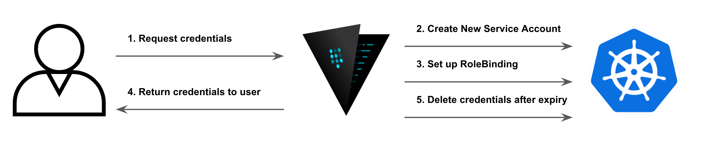

# Vault K8s Dynamic Service Accounts
[![GoReportCard][report-badge]][report]
[![License][license-badge]][license]

[report-badge]: https://goreportcard.com/badge/github.com/servian/vault-k8s-secret-engine
[report]: https://goreportcard.com/report/github.com/servian/vault-k8s-secret-engine
[license-badge]: https://img.shields.io/github/license/servian/vault-k8s-secret-engine.svg?style=flat
[license]: https://github.com/servian/vault-k8s-secret-engine/license


This project contains the source code for a [Hashicorp Vault](https://www.vaultproject.io/) plugin that provides
on-demand (dynamic) credentials for a short-lived [k8s](https://kubernetes.io/) service accounts.

This keeps the blast radius relatively small in case the credentials get leaked or abused.

----

**Note:** This plugin is still under active development

----

## Content

1. [Architectural overview](#Architectural-overiew)
1. [Using the secret engine](#Using-the-secret-engine)
1. [Installing the secret engine](#Installing-the-secret-engine)
1. [Configure The Secret Engine](#Configure-the-secret-engine)
1. [Vault policy](#Vault-policy)
1. [Build from Source](#Build-from-source)
1. [Local development](tests/readme.md)

## Architectural overiew

This plugin is designed around a 1:1 mapping between an instantiation of the secret engine and a Kubernetes cluster. This approach allowed us to simplify the usage and configuration of the plugin, while still targeting the major usecase of providing dynamic and short lived credentials for Kubernetes. The focus is the ease of use for both administrators and the end user, and limiting the configuration complexity was an easy choice.

The plugin follows the below flow when generting dynamic credentials. When a client requests a credential, vault will create a new service account in the Kubernetes cluster in the backend, and configure it with a specific role so it has the required access. 

The user will get the credentials returned from vault in the shape of a javasript web token and a certificate, which can be used to authenticate directly to the Kubernetes cluster.

Vault has an internal timer that will track the lifetime of the credentials, and when the assigned time to live has expired, it will automatically remove the service account from Kubernetes, which means the user can not use this anymore to access the Kubernetes cluster.



## Using the secret engine

To interact with the secret engine and generate new credentials for a kubernetes cluster, a read request is sent to the correct path. This will cause the plugin to reach out to the Kubernetes cluster and generate a new service account and bind it to the configured role. 

The path follows this pattern:

```text
<mount path>/service_account/<k8s namespace>/<service account type>
```

- `<k8 namespace>` is the namespace in the Kubernetes cluster that the service account will have access to
- `<service account type>` is the type of access the service account will have in the namespace, valid types are: `admin`, `editor`, and `viewer`

**Note:** The generated service account is always limited to a single namespace, and if additional namespaces are required, multiple requests are required to genereate additional service accounts.

parameter | description | required | default 
-|-|-|-
ttl_seconds | The time to live in seconds for the generated credential. The credentials will automatically be removed at the end of the lifetime. If the value is higher than the max ttl defined in the plugin configuration, max ttl will be used instead | false | 600

### Usage example

In this example we generate a new service account with the viewer permission to the default namespace. We also request that the credentials will be available for 30 minutes (1800 seconds).

```sh
vault read k8s/service_account/default/viewer ttl_seconds=1800
```

For automation in a CI/CD environment, making the output json makes it easier to interact with. This is the same example as above, but with the output format configured to be json.

```sh
vault read k8s/service_account/default/viewer ttl_seconds=1800 --format=json
```


## Installing the secret engine plugin

To install the secret engine, download the latest version of the plugin from Github, or build a new copy from source in your target environment, and upload it to your vault instances under the plugin directory (usualy `plugins/`).

More details on how to install plugins into vault can be found in the [official documentation](https://www.vaultproject.io/docs/internals/plugins)


## Configuring the Secret engine

Each instantiation of the secrete engine is mapped to a single Kubernetes cluster, and it needs to be configured with the details to connect to the cluster. In addition to that ClusterRoles needs to be deployed in the target cluster for the three types of roles supported: admin, editor, and viewer. These ClusterRoles can be configured with any permissions, but it is recommended to align the permissions to match the name as much as possible.

The secrete engine is configured using the `<mount path>/configure` path

parameter | description | required | default 
-|-|-|-
admin_role | Name of the Kubernetes Cluster Role that will be used for a service account with admin rights to a namespace| true |
editor_role | Name of the Kubernetes   ClusterRole that will be used for a service account with editor rights to a namespace | true | 
viwer_role | Name of the kiubernetes ClusterRole that will be used for a service account with viewer rights to a namespae | true |
jwt | The JWT for the service account that vault use to authenticate to Kubernetes and create service accounts and RoleBindings | true | 
base_url | The url to the Kubernetes management plane API. Pattern: https://<url>:<port>| true | 
max_ttl | Maximum lifetime in seconds for a service account created using the  | false | 1800

### Usage example
```sh
vault write k8s/config \
admin_role="admin" \
editor_role="editor" \
viewer_role="viewer" \
jwt="${sa_token}" \
ca_cert="${k8_cacert}" \
max_ttl=600
```

### Why ClusterRole instead of a Role object in Kubernetes?

A Role is scoped to a specific namespace, and cannot be used outside of that specific namespace. This means a map of role <-> namespace has to be created for each namespace in the cluster. And if a new namespace is added it will require a reconfiguration of the secrete backend. 

A ClusterRole on the other hand is scoped to the whole cluster. This means it can be re-used across all namespaces. We use a RoleBinding instead of a ClusterRolebinding to limit the scope of a binding to a single namespace.

This approach allows us to dynamically adjust to changes in the K8s cluster without compromising security. Vault policy is relied upon to limit access for a client to only the namespaces and service account type they require access to.

## Vault policy

Configuring policies for the secret engine follows normal vault conventions by providing a detailed path for the different name spaces and types of access. The path follow the pattern defined below, which makes writing policies to align with least privelege access possible.

```text
<mount path>/service_account/<k8s namespace>/<service account type>
```

## Build from source

### Dependencies

- Golang >=1.16.2
- make


### Building

The build has been mostly automated using make, allowing for a simple way to build the binary on the local environment. It curently produces a binary that can run in the environment it is built, e.g. build on macOS will generate a binary for macOS.

The build command will produce a single binary in the subfolder `vault/plugins/`

**Build command:**
```sh
make build
```


## Potential future improvements
 
- output a kubeconf file as an option
